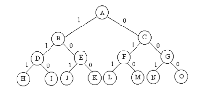

# 算法设计与分析

---

## 复杂性分析

### 函数渐进的界　

1. 若存在正数c和n0使得对一切n >= n0有0 <= f(n) <= cg(n)成立，则称f(n)的渐进的上界是g(n)，记做f(n) = O(g(n))。

2. 若存在正数c和n0使得对一切n >= n0有0 <= cg(n) <= f(n)成立，则称f(n)的渐进的下界是g(n)，记做f(n) = Ω(g(n))。

3. 若f(n) = O(g(n))且f(n) = Ω(g(n))，则称f(n) = Θ(g(n))，称为紧渐进界。

---

## 分治策略

### 基本概念

简而言之就是把一个复杂问题分成两个或者多个相同或相似的子问题，再把子问题分成更小的子问题，直到最后子问题可以简单的直接求解，最终原问题的解就是各个子问题的合并。常见的运用如快速排序或归并排序等。

任何一个问题的计算时间都与其规模有关，问题规模约小越容易求解，比如归并排序在n=1时，不需要任何计算，只要做一次比较就可以排序好。

### 基本思想及策略

#### 设计思想

将一个难以解决的大问题，分割成规模较小的相同问题，以便各个解决。

#### 分治思路

对于一个规模为n的问题，如果能够直接求解则直接得到结果，否则将该问题分解成k个具有相同问题形式但规模较小的问题，这些子问题相互独立。求解这些子问题使用递归的方式，最后将各个问题的解合并得到原问题的解。

### 分治适用情况

1. 问题缩小到一定规模可以容易地解决。

2. 该问题可以分解为若干规模较小的相同问题，即该问题具有最优子结构性质。

3. 利用该问题分解出的子问题的解可以合并成该问题的解。

4. 各个子问题是相互独立的。

其中第一条通常很容易达到，第二条特征反映了递归思想。第三条是分治算法的关键，如果不满足这条特征可以考虑贪心或动态规划法。第四条涉及分治的效率，如果各子问题不独立会重复做很多不必要的工作，这种情况通常考虑动态规划算法。

### 分治基本步骤

分治在每一层递归上都有三个步骤：

1. 分解：将远问题分解成若干规模较小，相互独立与原问题西安鬼头鬼脑的子问题。

2. 解决：若子问题可以直接解决则解决，否则递归调用分拆成更小的子问题。

3. 合并：将各个子问题和并为原问题的解。

### 分治的复杂性分析

分治将规模为n的问题分成k个规模为n/k的子问题去解决，假设原问题分解为k个子问题以及用merge将k个子问题的解和并为远问题的解需要f(n)个单位时间，T(n)表示该分治法规模为n所耗费的计算时间。

- T(n) = k•T(n/k) + f(n)

- T(1) = c

这里通过求解递归式得到算法的复杂度，这里用归并算法为例。

- T(n) = 2•T(n/2) + n - 1

- T(1) = 0

设n = 2k，则原式子可化为：

T(2k) = 2•T(2k-1) + 2k - 1
    
= 2•[2•T(2k-2) + 2k-1 - 1] + 2k - 1

= 22T(2k-2) + (2k - 2) + (2k - 1)

= ……

= 2k•T(2k-k) + (2k - 2k-1) +……+(2k - 20)

因为T(1) = 0，所以上式可化简为：

T(n) = T(2k)

= k•2k - (20 + 21 +……+2k-1)

= k•2k - (2k - 1)

因为n = 2k，所以k = log2n，带入可得：

T(n) = n•log2n - n + 1

### 分治法经典应用

1. 二分查找

2. 大整数乘法

3. Strassen矩阵乘法

4. 棋盘覆盖

5. 归并排序

6. 快速排序

7. 汉诺塔

8. 最接近点问题

### 思维过程

类似数学归纳法，先找到小规模时候求解方法，再考虑规模增大时求解方法，找到递归函数式之后设计递归程序即可。

### 基本框架

列出三个经典分治算法（归并排序、快速排序和最大子串和）的主体部分用作例子：

1. 归并排序：

		void mergesort(int a[], int first, int last, int temp[])
		{

			if (first < last)
			{
				int mid = (first + last) / 2;
				mergesort(a, first, mid, temp);    //左边有序
				mergesort(a, mid + 1, last, temp); //右边有序
				mergearray(a, first, mid, last, temp); //再将二个有序数列合并
			}
		}
		
2. 快速排序：

		void quick_sort1(int s[], int l, int r)
		{
			if (l < r)
    		{
				int i = adjustarray(s, l, r);//先成挖坑填数法调整s[]
				quick_sort1(s, l, i - 1);    //递归调用 
				quick_sort1(s, i + 1, r);
			}
		}
		
3. 最大子序列和：

		int MaxSubSum(int A[], int Left, int Right)
		{	
			if (Left == Right)    //递归的基准情形
        		return a[Left];

    		int Center, MaxLeftSum, MaxRightSum;
    		Center = (Left + Right) / 2;   //求分界点
  
    		MaxLeftSum = MaxSubSum(A, Left, Center);    //递归左子序列
    		MaxRightSum = MaxSubSum(A, Center + 1, Right);  //递归右子序列
    		
    		int MaxLeftBorderSum = A[Center], LeftBorderSum = A[Center];
    		for (int i = Center - 1; i >= Left; --i) {
       			LeftBorderSum += A[i];
        		if (LeftBorderSum > MaxLeftBorderSum)
            		MaxLeftBorderSum = LeftBorderSum;
    		}

    		int MaxRightBorderSum = A[Center + 1], RightBorderSum = A[Center + 1];
    		for (int i = Center + 2; i <= Right; ++i) {
        		RightBorderSum += A[i];
        		if (RightBorderSum > MaxRightBorderSum)
           			MaxRightBorderSum = RightBorderSum;
    		}

    		//返回最大值
    		return Max3(MaxLeftSum, MaxRightSum, MaxLeftBorderSum + MaxRightBorderSum);
		}

因为分治算法要结合递归来写，所以通常的分治算法框架是：

1. 判断语句，递归结束条件。

2. 划分点计算。

3. 划分点左部分递归。

4. 划分点右部分递归。

5. 综合两侧答案。

从上面三个例子来看，条件判断、划分点计算、递归左右部分的过程还是比较清晰的。主要不同之处在于最后一步上，在归并排序中，通过递归后的归并步骤实现对几个有序子序列的合并，而快速排序则通过划分时的处理阶段已经使其中某个元素在最后的位置上了。最大子序列和的实现在最后返回的语句中有很明显的综合序列答案的过程，不过这里情况比较特殊，实际上是对三种情况进行选优选择。

---

## 动态规划

### 基本概念

每次决策依赖于当前状态，又随即引起状态的转移。一个决策序列就是在变化的状态中产生的，所以这种多节点优化决策解问题的过程就称为动态规划。

### 基本思路及策略

基本思想和分治法类似，将待求解问题分为若干子问题，按顺序求解子阶段，前一子阶段的解为后一阶段的决策提供了有用信息。在求解任一子问题时，列出各种可能的局部解，通过决策保留那些有可能达到最优的局部解，丢弃其它的局部解。依次解决各个子问题，最后一个问题的解就是初始问题的解。

采用动态规划解决的问题依赖于之前的状态，所以通常有重叠子问题这个特点，为了减少计算，对每一个问题只求解一次，将其不同的状态保存在一个二维数组中。也就是说动态规划之所以能够快速解决含有重叠子结构问题最主要的原因是已经通过数组记录下了之前的状态，而不需要每次重新计算。

相比于分治法，动态规划最大的区别在于：适用于动态规划求解的问题，其各个子问题并不是完全独立的，下一阶段的状态需要考虑前一阶段的值。而分治法被划分出的各个子问题间却是相互独立的。不存在依赖关系。

### 适用情况

通常使用动态规划时，问题具有如下性质：

1. 最优化原理：如果问题的最优解所包含的子问题的解也是最优的，则该问题具有最优子结构，即满足最优化原理。

2. 无后效性：即某个状态一旦确定，就不受这个状态以后的决策影响。也就是说，某状态以后的过程不会影响以前的状态，只与当前状态有关。

3. 有重叠子问题：即子问题间不是独立的，一个子问题在下一阶段的决策中被多次用到。（非必要条件，但不具有此性质，动态规划相比于其他算法不具有优势）

### 基本步骤

动态规划所处理的是一个多阶段决策问题，由初始状态开始，经过中间状态达到最终的结束状态，形成一个决策序列。

一般需要经历以下步骤：

1. 划分阶段：按照问题时间或空间特征，把问题分为若干阶段。在划分阶段，注意划分后的阶段一定要是有序的或者是可排序的，否则问题就可能无解。

2. 确定状态和状态变量：将问题发展到各个阶段所处的各种客观情况用不同状态表示出来。当然，状态的选择要满足无后效性。

3. 确定决策并写状态转移方程：因为决策和状态转移有天然联系，状态转移就是根据上衣阶段的状态和决策导出本阶段的状态。所以如果决定了决策，状态转移方程也就可写出。但事实上实际上是反过来做，根据相邻的两个状态之间的关系来确定决策的方法和状态转移方程。

4. 寻找边界条件：给出状态转移方程是一个递推式，需要一个递推中止条件或边界条件。

实际应用中可以按照以下简化步骤设计：

1. 分析最优解性质，刻画结构特征。

2. 递归的定义最优解。

3. 自底向上或自顶向下的记忆化方式计算出最优解。

4. 根据最优值得到的信息，构造问题最优解。

### 算法实现说明

使用动态规划解决问题，最重要的就是动态规划三要素了：

1. 问题的阶段。

2. 每个阶段的状态。

3. 从前一个状态转化到后一个状态的递推关系。

递推关系往往是从小问题到大问题的转化，所以动态规划问题通常可以通过递推关系式来实现，不过相比于递归，递推可以保存子问题的解来减少重复计算量。

整个求解过程可以用最优决策表来描述，最优决策表是一个二维表，其中行表示决策的阶段，列表示问题的状态，表格需要填写数据对应此问题在某个阶段某个状态下的最优值，填表过程就是根据递推关系从第一行第一列开始依次填表，最后通过简单读表即可得到最优解。

### 基本框架

这里举三个例子（0-1背包、最长上升子序列和最大子序列和），其中最大子序列和也是分治部分的例子。

1. 0-1背包：

		int max(int i, int j)
		{
			if((DP[i - 1][j - items[i].weight] + items[i].value) > DP[i - 1][j])
				return DP[i -1][j - items[i].weight] + items[i].value;
			else
				return DP[i -1][j];
		}

		void pack(){
			int i, j;
			for(i = 1; i < ITEM_NUM; ++i){
				for(j = 1; j < BAG_SIZE; ++j){
					if(j < items[i].weight){
						DP[i][j] = DP[i - 1][j];
						continue;
					}
					DP[i][j] = max(i, j);
				}		
			}
		}

2. 最长上升子序列：

		int SubUp(int *array, int *max, int length)
		{
			max[0] = 1;
			for(int i = 1; i < length; ++i){
				int len = 0;
				for(int j = 0; j < i; ++j){
					if(array[j] < array[i]){
						int len = max[j] + 1;
						if(len > max[i])
							max[i] = len;
					}
				}
			}
			return max[length - 1];
		}

3. 最大子序列和：

		int MaxSubSum(int A[], int N)
		{
			int ThisSum, MaxSum, i;
			ThisSum = MaxSum = 0;
			for(int i = 0; i < N; ++i){
				ThisSum += A[i];
				if(ThisSum > MaxSum)
					MaxSum = ThisSum;
				else if(ThisSum < 0)
					ThisSum = 0;
			}
			return MaxSum;
		}
		
---

## 贪心算法

### 基本概念

在对问题求解时，总是做出在当前看来最好的选择，也就是说，并不从整体最优来考虑问题，所做出的仅是某种意义上的局部最优解。最终通过一系列局部最优解来达到全局最优解，所以说能使用贪心算法正确求解的问题具有最优子结构。

贪心算法往往得不到整体最优解，选择贪心策略必须具备无后效性，即某个状态以后的过程不会影响以前的状态，只与当前状态有关。

### 适用情况

贪心策略适用的前提是：局部最优能导致产生全局最优解。可适用情况很少。

---

## 回溯法

### 基本概念

回溯法实际上是一个类似枚举的搜索尝试过程，在搜索中寻找可能解，当发现已不满足求解条件时，就逐层向其祖先节点回溯，尝试别的路径。回溯法是选优搜索法，按选优条件向前搜索，以达到目标。但当搜索到某一步时，发现原先选择达不到目标，就退回一步重新选择，这种走不通就回退技术为回溯法，满足回溯条件的某个状态点称为回溯点。

### 基本思想

在包含问题所有解的解空间树中按照深度优先搜索策略，从根节点出发深度搜索解空间树，当搜索到某一节电时，先判断以该节点为根节点的子树中是否包含问题的解，如果包含则继续探索下去，否则逐层向根节点回溯。

若要用回溯法求解所有的解，要回溯到根且根节点所有可行的子树都要已被搜索遍才结束。

若要求任一解，搜索到一个解即可结束。

### 回溯法一般步骤

1. 针对问题，确定问题解空间。

2. 确定节点扩展搜索规则。

3. 以深度优先方式搜索解空间，在搜索过程中用约束函数剪枝避免无效搜索。

### 基本概念及过程

1. 活节点：

	不是叶子节点，并且满足约束条件和目标函数的界，同时这个节点的所有儿子节点还没有全部搜索完毕。
	
2. 扩展节点：

	当前正在搜索其儿子节点的节点，必然属于活节点。
	
3. 死节点：

	不满足约束条件或目标函数的节点，或儿子节点已经全部搜索完毕的节点，或者是叶节点。
	
当搜索到一个活节点时，就把这个节点变为拓展节点，继续向下搜索这个节点的儿子节点。当搜索到一个死节点还未能得到问题的最终解时，就向上回溯到它的父亲节点。如果这个父亲节点当前还是拓展节点，则继续搜索这个父亲节点的另一个儿子节点。如果这个父亲节点随着所有的儿子节点都搜索完毕变成死节点，就沿着这个父亲节点向上，回溯到更上一级节点。这个过程一直重复到找到最终解或者根节点变为死节点为止。

### 回溯例子

下面用一个0-1背包的完整例子来解释回溯法。

假设有n = 3, w = {16, 15, 15}, v={45, 25, 25}。

其中约束条件非常简单，就是第i个物品放入背包后重量是否仍小于背包大小，若不满足则回溯，以该节点为父节点的子树被剪枝。每当遍历到叶子节点得到一个结果，每得到一个结果就将这个结果与当前已有最大值比较，若更大则更新。

- 初始时，Cw = C = 30，Cv = 0，A是唯一活节点。

- 搜索A节点子节，A成为拓展节点。

- 拓展A达到B节点

	- Cw = Cw - C1 = 14，Cv = Cv + V1 = 45
	
	- 此时A、B为活节点，拓展B，B成为当前拓展节点。
	
	- 拓展B到达D。
	
		- 由于Cw < C2，D导致不可行解，回溯到B。
		
	- 拓展B到E。
	
		- E可行，此时活节点为A，B，E，其中E是新的拓展节点。
		
		- 拓展E到J。
		
			- Cw < w3，J导致一个不可行解，回溯到E节点。
			
		- 拓展E到K。
		
			- K是叶子节点，得到可行解x = (1, 0, 0)，Cv = 45。
			
			- K不可拓展，成为死节点，返回E。
			
		- E子节点都拓展完，成为死节点，返回B。
	
	- B没有拓展节点，成为死节点，返回A。
	
- A再次成为拓展节点，拓展A到C。

	- Cw = 30，Cv = 0，C成为新拓展节点。
	
	- 拓展C，先达到F。
	
		- Cw = Cw - w2 = 15，Cv = Cv + v2 = 25，此时活节点为A、C、F，其中F成为当前拓展节点。
		
		- 拓展F，到达L。
		
			- Cw = Cw - w3 = 50。
			
			- L是叶节点，且50 > 45，得到一个可行解x = (0, 1, 1)，Cv = 50。
			
			- L为叶子，不可拓展，成为死节点，回溯到其父节点F。
			
		- 拓展F，到达M。
		
			- M是叶子，但25 < 50，非最优解，不用更新最优解。
			
			- M不可拓展，成为死节点，回溯到F。
		
		- F无孩子节点未访问，成为死节点，返回C。
		
	- C拓展到G。
	
		- Cw = 30，Cv = 0，活节点为A，C，G，其中G为当前拓展节点。
		
		- 拓展G，到达N。
		
			- N是叶子节点，且解25 < 50，不用更新。
			
			- N不可拓展，成为死节点，回溯到G。
			
		- 拓展G，到O。
		
			- O是叶子节点，且0 < 50，不是最优解，不用拓展。
			
			- O不可拓展，返回到G。
		
		- G没有可拓展节点，成为死节点，返回C。
	
	- C没有拓展节点，成为死节点，返回A。
	
- A没有可拓展节点，成为死节点，算法结束，最优解为bestX = (0, 1, 1)，最优值bestV = 50。

### 回溯法经典应用

1. N皇后问题

2. 图的着色问题

3. 马的遍历问题

4. 装载问题

### 基本框架

这里给出了N皇后问题的例子。

1. N皇后问题：

		bool place(int k)
		{
   			int i;
    		for(i=1;i<k;i++)
        		if(x[k]==x[i]||abs(k-i)==abs(x[k]-x[i]))
            		return false;
        		return true;
		}

		void queue(int n)
		{
    		int i,k;
    		for(i=1;i<=n;i++)
        		x[i]=0;
    		k=1;
    		while(k>=1)
    		{
        		x[k]=x[k]+1;   //在下一列放置第k个皇后
        		while(x[k]<=n&&!place(k))
            		x[k]=x[k]+1;//搜索下一列
        		if(x[k]<=n&&k==n)//得到一个输出
        		{
            		for(i=1;i<=n;i++)
                		printf("%d ",x[i]);
            		printf("\n");
        			//return;
        			//若return则只求出其中一种解，若不return则可以继续回溯，求出全部的可能的解
        		}
        		else if(x[k]<=n&&k<n)
            		k=k+1;//放置下一个皇后
        		else
        		{
            		x[k]=0;//重置x[k],回溯
            		k=k-1;
        		}
    		}
		}

---

## 分支限界法

### 基本概念

分支限界法是用于求解组合优化问题的排除非解的搜索算法。类似于回溯法，也是一种在问题的解空间树上搜索问题解的算法。但在一般情况下，分支限界法与回溯法的求解目标不同。

回溯法的求解目标是找出中满足约束条件的所有解，而分支限界法的求解目标则是找出满足约束条件的一个解，或是在满足约束条件的解中找出使某一目标函数值达到极大或极小的解，即在某种意义下的最优解。

常见的分支限界法为广度优先分支限界法和优先队列式分支限界法，最主要的区别在于选择拓展节点时是按一般队列顺序选择队列的首元素还是通过优先队列选择具有最优结果的元素。

### 分支限界法一般过程

分支限界法以广度优先的方式搜索解空间树。

分支限界发法搜索策略：在拓展节点处，先生成其所有儿子节点（分支），然后再从当前的活节点表中选择下一个扩展节点。为了有效地选择下一扩展节点，以加速搜索进程，在每一个活节点处，计算一个函数值，并根据这些已计算出的函数值，在当前活节点表中选择一个最有利的节点作为扩展节点，使搜索朝着解空间树上最优解推进。

分支限界法常以广度优先或以最小耗费（最大效益）优先的方式搜索问题的解空间树。问题的解空间树是表示问题解空间的一棵有序树，常见的有子集树和排列树。在搜索问题的解空间树时，分支限界法与回溯法对当前扩展结点所使用的扩展方式不同。在分支限界法中，每一个活结点只有一次机会成为扩展结点。活结点一旦成为扩展结点，就一次性产生其所有儿子结点。在这些儿子结点中，那些导致不可行解或导致非最优解的儿子结点被舍弃，其余儿子结点被子加入活结点表中。此后，从活结点表中取下一结点成为当前扩展结点，并重复上述结点扩展过程。这个过程一直持续到找到所求的解或活结点表为空时为止。

### 分支限界例子

这里依旧用0-1背包的完整例子来就是分支限界法。

假设n = 5, w = {8, 16, 21, 17, 12}, v = {8, 14, 16, 11, 7}。

先定义好基本规则：

1. 定义三个集合S1，S2和S3。

	- S1表示装入背包的物体集合，初始为空。
	
	- S2表示不装入背包的物体集合，初始为空。
	
	- S3表示尚待选择的物体集合，初始为{0, 1, 2……n-1}。
	
2. 先将物品按照单位重量价值最大的顺序排序，排序后物品按单位质量价值从高到低编号0到n-1。

3. 计算上界函数值b。

	- b的值为当前背包里物品总价值 + 完整可放入背包中物品的价值 + 剩余背包容量*当前可选物品的单位价值。
	
	- 每次都是按单位价值排序后的物品顺序来做上述上界函数计算的。
	
	- 若选择某个物品放入背包后总质量大于背包总大小，则b = 0。

4. 每次将生成的新节点放入优先队列中。
	
5. 每次从优先队列中取出堆顶节点，根据该节点S3集合中单位价值最高的物品是否放入背包来生成新节点。

具体过程如下：

1. 排序：

	| 序号 | 重量  | 价值  | 单位价值 |
	| ----| :---: | :---: | :---: |
	|  0  |   8   |   8   |    1  |
	|  1  |   16  |   14  |  0.875|
	|  2  |   21  |   16  |   0.76|
	|  3  |   17  |   11  |   0.65|
	|  4  |   12  |   7   |   0.58|
	
2. 初始化：
	
	| 节点名| S1| S2|S3|   b   |
	| :---:| :----------: |:-----------:|:-------:| :---------:|
	| A    | {NULL}      |   {NULL}    |{0, 1, 2, 3, 4} | 0    |

3. 程序执行：

	- 计算第0个物品是否放入，计算b值，并生成B、C节点，均加入优先队列。
	
		| 节点名| S1| S2|S3|   b   |
		| :---:| :----------: |:-----------:|:-------:| :---------:| 
	    | B    | {0}          |   {NULL}    |{1, 2, 3, 4} |  31.9  |   
	    | C    | {NULL}       |   {0}       |{1, 2, 3, 4} |  30    |  
	  
	- 选择B节点并从优先队列中移出，该移出的节点参与接下来序号为1节点的计算。根据序号1节点是否放入，生成D、E节点。
	
		| 节点名| S1| S2|S3|   b   | 
		| :---:| :----------: |:-----------:|:-------:| :---------:|
	    | D    | {0, 1}       |   {NULL}    |{2, 3, 4}    |  31.9  |
	    | E    | {0}          |   {1}       | {2, 3, 4}   | 29.176 | 
	    
	    此时队列中节点{C, D, E}，上限最大的为D节点，上限为31.9。
	   	    
	- 从优先队列中选择D节点，根据序号2节点是否放入，生成F、G节点。
	
		| 节点名| S1| S2|S3|   b   | 
		| :---:| :----------: |:-----------:|:-------:| :---------:| 
	    | G    | {0, 1}       |   {2}       |{3, 4}    |    30.41  |  
	    | F    | {0, 1, 2}    |   {NULL}    | {3, 4}   | 0         |  
	    
	    此时队列中节点{C, E, G, F}，上限最大的为G节点，上限为30.41。	    
	- 从优先队列中选择G节点，根据序号3节点是否放入，生成H、I节点。

		| 节点名| S1| S2|S3|   b   | 
		| :---:| :----------: |:-----------:|:-------:| :---------:| 
	 	| I    | {0, 1}       |   {2， 3}    | {4}         |  29   |  
	    | H    | {0, 1, 3}    |   {2}       | {4}          | 0     | 
	    
	   此时队列中节点{C, E, F, H, I}，上限最大的为C节点，上限为30。
	    
	- 从优先队列中选出C节点，C节点中S3集合中有{1, 2, 3, 4}四个节点仍未选择，所以接下来根据序号1节点是否放入生成J、K节点。

		| 节点名| S1| S2|S3|   b   |
		| :---:| :----------: |:-----------:|:-------:| :---------:|
	    | J    | {1}          |   {0}       | {2, 3, 4}  |   30    | 
	    | K    | {NULL}    |   {0, 1}    | {2, 3, 4}     |  26.35  |  
	    
	    此时队列中节点{E, F, H, I, J, K}，上限最大的为J节点，上限为30。

	- 选择J节点，考虑物品2是否放入，生成L、M节点。
	
		| 节点名| S1| S2|S3|   b   | 
		| :---:| :----------: |:-----------:|:-------:| :---------:| 
	    | L    | {1, 2}       |   {0}       | {3, 4}  |   30       |   
	    | M    | {1}          |   {0, 2}    | {3, 4}  |  27.3      |  
	    
	    此时队列中节点{E, F, H, I, K, L, M}，上限最大的为L节点，上限为30。
	    
	- 选择L节点，考虑物品3是否放入，生成N、O节点。
	
		| 节点名| S1| S2|S3|   b   | 
		| :---:| :----------: |:-----------:|:-------:| :---------:| 
	    | O    | {1, 2}       |   {0, 3}    | {4}     |   30       |  
	    | N    | {1, 2, 3}    |   {0}       | {4}     |   0        |   
	    
	    此时队列中节点{E, F, H, I, K, M, N, O}，上限最大的为O节点，上限为30。	    
	- 选择O节点并决定序号为4的节点是否放入，生成P、Q节点。
	
		| 节点名| S1| S2|S3|   b   | 
		| :---:| :----------: |:-----------:|:-------:| :---------:|
	    | Q    | {1, 2}       |   {0, 3, 4}  | {NULL}  |   30      |  
	    | P    | {1, 2, 4}    |   {0, 3}     | {NULL}  |    0      |  
	    
	    此时队列中节点{E, F, H, I, K, L, M}，上限最大的为Q节点，上限为30。	    
	- 选择Q节点，但Q节点的S3集合已为空，所以程序结束。
	
4. 程序结束：

	背包中物品为S1 = {1, 2}，最大值为30。
	
    	
---

## NP完全性理论

### 基本概念

1. 以多项式为时间复杂度的算法称为多项式时间算法，有多项式时间算法的问题称作易解的，不存在多项式时间算法问题称作难解的。

2. 所有多项式时间可解的判定问题组成的问题类称作P类问题（易解问题）。

3. 存在判定问题，若给定某问题结果I，存在算法A可在多项式时间内对结果进行验证，则称此判定问题是可验证的，A是其多项式时间验证算法。所有有多项式时间可验证的判定问题组成的问题类称为NP（非确定型多项式）问题。

4. P属于NP。

5. 如果存在某个问题的难度不低于NP问题中任何问题，则这样的问题称为NP难（NP-Hard）问题。

6. 如果某个问题既属于NP问题又是NP难问题，则这个问题是NP（NPC）完全的。

7. 证明P = NP的充分必要条件是NP完全问题属于P问题。

### 通俗理解　

就是在所有的问题中，如果在多项式时间内可以得到结果的问题称为P问题，但是有些问题尚不能被证明是否存在多项式时间内时间算法，不过很多这类问题虽然求解具体的答案比较复杂，但是如果给定一个确定的结果，还是很容易在多项式时间内验证是否满足此问题，这种问题称为NP问题。

在所有NP问题中，我们假设存在最困难的问题，这个问题的不会比任何NP问题简单，则这个问题称为NPC问题。如果我们证明了最难的NP问题（即NPC问题）都能够在多项式时间内求解，则一定可以得到P = NP。所以目前对于P是否等于NP的研究主要取决于NPC问题和P问题的关系。

---

## 近似算法
