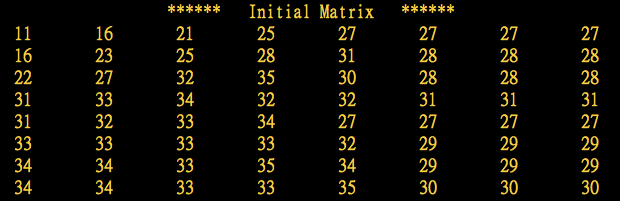

# JPEG 压缩编码算法的主要计算步骤如下:
* RGB到YCbCr的颜色空间变换
* 8*8分块
* 正向离散余弦变换(FDCT)
* 量化(quantisation)
* Z字形编码(zigzag scan)
* 使用差分脉冲编码调制(DPCM)对直流系数(DC)进行编码
* 使用行程长度编码(RLE)对交流系数(AC)进行编码
* 熵编码(Huffman或算术)

---

# 实验截图

### 源图像样本
* 呈现样本数据 -128

### FDCT系数

### 色差量化表

### 量化系数

### 反量化系数

### 重构图像样本

